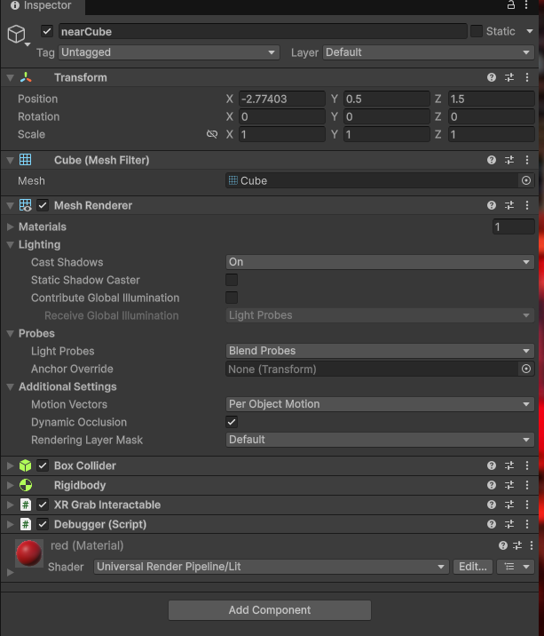
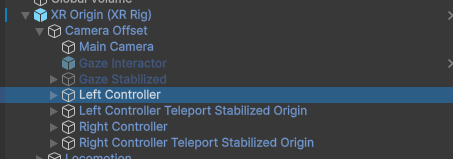
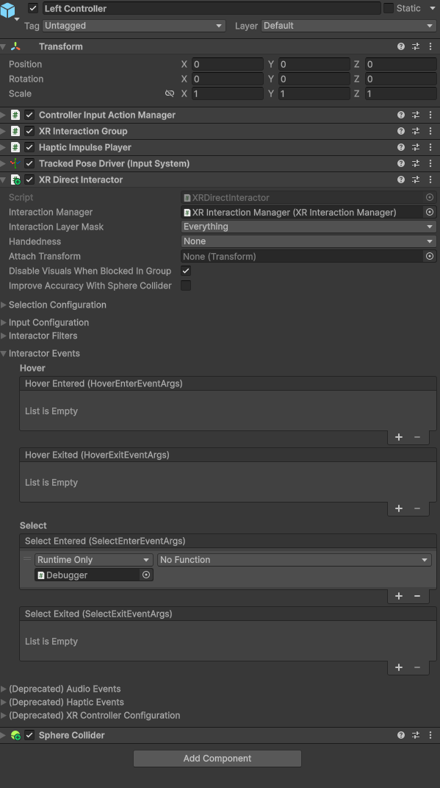
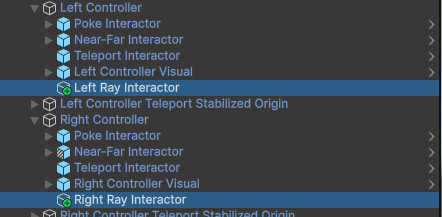
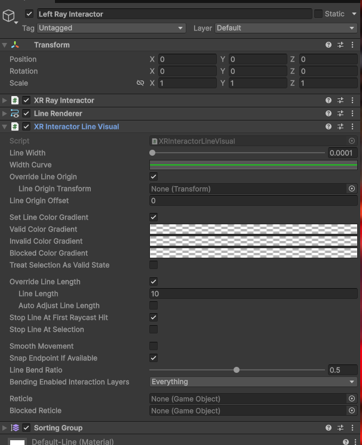
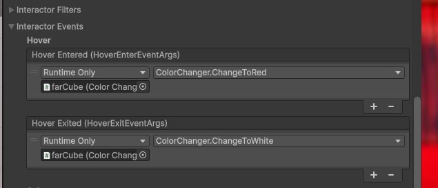

# Exercise

To make the exercise we add two cubes, I named as nearCube and farCube.

To configure them to be grabbable by the user we add the xr grab interactable component to each of them. Also is needed to add a collider and a rigidbody to each cube.

nearCube:



farCube:


Also I add code to each of them to make the change of color or debug message.

To see the code see the [here](Assets/Scripts/Debugger.cs) to see the debug message code and [here](Assets/Scripts/ColorChanger.cs) to see the color change code.

The added code is the following:

Debugger.cs

```csharp
    public void OnPointerClick()
    {
        Debug.Log("Object clicked: " + gameObject.name);
    }
```

ColorChanger.cs

```csharp
    public void ChangeToRed()
    {
        if (sphereRenderer != null)
            sphereRenderer.material.color = Color.red;
    }

    public void ChangeToWhite()
    {
        if (sphereRenderer != null)
            sphereRenderer.material.color = Color.white;
    }
```

To be interactable I add a xr interaction manager, then in the XR origin (XR rig) exist two controller. I added a xr direct interactor to each controller.



Then I add the event trigger to nearCube to call the Debugger OnPointerClick method when the select event is called.



Finally I add an empty object to make a xr ray interactor, I named it Left (or Right) Ray Interactor. I added the xr ray interactor component to it and also a line renderer to see the ray. These line is not visible because the original XR origin has a line renderer too.

The empty object is child of the left (or right) controller, and looks like this:



To Disable the line renderer I change the next properties:



To add the events to farCube I use the xr ray interactor I just created. I add the event trigger to farCube to call the ColorChanger ChangeToRed method when the hover event is called and ChangeToWhite method when the deselect event is called.

